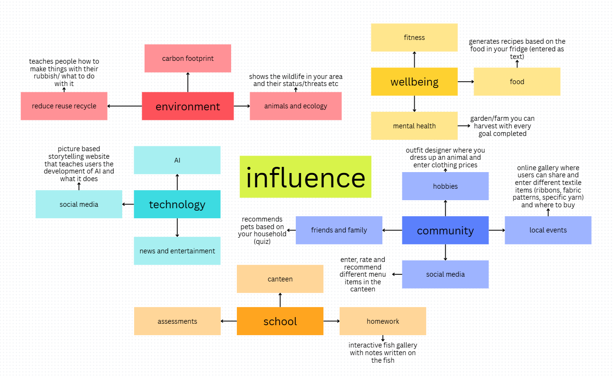
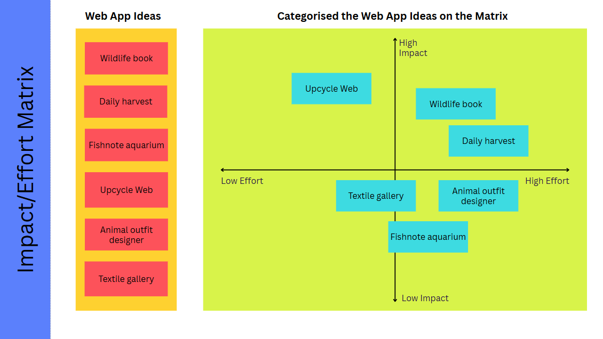
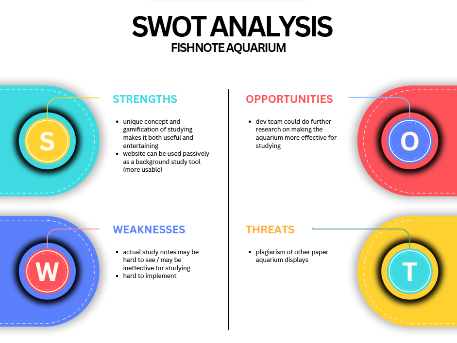
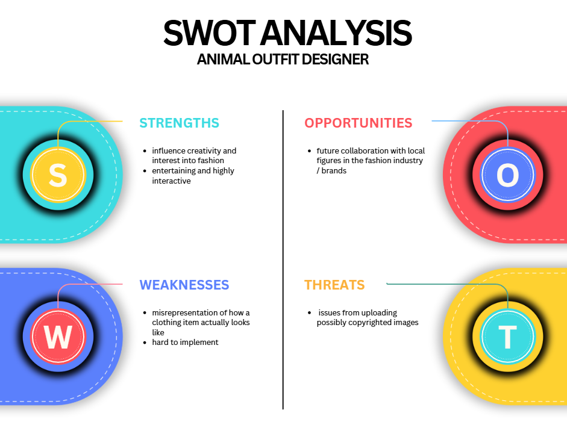
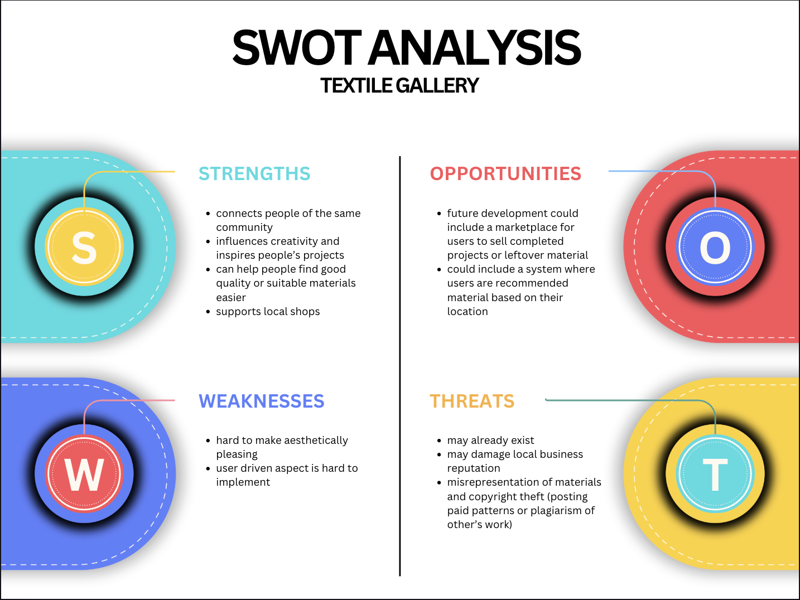

# 10CT-TASK 2
## Brainstorm: Divergent and Convergent thinking
### Mindmap (diverge):

### 6 Big Ideas (diverge):
| Idea name |  What it does | Influence it Explores| Who it helps|
| --- | --- | --- | ---|
| Wildlife book | Interactive graphic website which shows the wildlife in an entered area (on a map) and their basic qualities eg, status, threats in a brief yet informative profile| Entertainment/ Public safety/ Environmental awareness | General public with an average english reading level|
| Daily harvest| A graphic game-like app where the user sets goals (eg, drink a cup of water) assigned to different vegetables which they can harvest and sell at the end of the day | Physical and Mental health/ Wellbeing | General public (english)
|Fishnote aquarium| A graphic interactive app with colour/species coordinated fish (for different subjects, priorities, etc) which users can write notes on their scales| Study motivation/ Education| Students/ General public (english)
|Upcycle Web| Website which provides step by step guides on how to upcycle common household rubbish, aiming to reduce waste and promote a circular economy| Environmental sustainability/ Hobby| General public (english)
|Animal outfit designer| An app where users can design outfits by dressing up animals in uploaded clothing items with assigned prices and links. The user can then decide to export the outfit (png) with a calculated final price if they wish to purchase.| Fashion/ Entertainment| General public/ Users interested in fashion or outfit design
|Textile gallery| An interactive website where users can upload their textile projects, recommend different materials (eg. fabric patterns, ribbons, textures) and where said materials are available for purchase in a graphic gallery.| Hobby | General public/ Users interested in textiles or craft

### Impact/Effort matrix (converge):
 

 ### SWOT peer anaylsis (converge):
 
 
 

**NEED EDITING**

Both Yuna and Arisa's SWOT feedback has allowed me to draw valuable insights on my project ideas and weaknesses that I may have to address and work in consideration while I produce my projects. 
While the fishnpte aquarium is generally a good idea blah blah baljh, I will need to be able to find a way to blah blah make the website more sueful overall- the fish swimmigna roudnd you cant see, cant see, hard to imp-lement with my current timeframe and has a large learning curve

...

ANimal outfit designer is unique idea and is hgihly interactive, but it can misrespresent certain clothign and may come to have copyright issues,

However..... "", making  it a more suitbale choice for my final project overall. 
## Design brief

### Requirements Outline: (Functional requirements)
1. Home page:
2. Sections:
3. post page
4. dropdown menu

### Requirements Outline: (Nonfunctional requirements)
1. Performance
2. Usability
3. Reliability
4. Security

