# 10CT-TASK 2
## Brainstorm: Divergent and Convergent thinking
### Mindmap (diverge):

### 6 Big Ideas (diverge):
| Idea name |  What it does | Influence it Explores| Who it helps|
| --- | --- | --- | ---|
| Wildlife book | Interactive graphic website which shows the wildlife in an entered area (on a map) and their basic qualities eg, status, threats in a brief yet informative profile| Entertainment/ Public safety/ Environmental awareness | General public with an average english reading level|
| Daily harvest| A graphic game-like app where the user sets goals (eg, drink a cup of water) assigned to different vegetables which they can harvest and sell at the end of the day | Physical and Mental health/ Wellbeing | General public (english)
|Fishnote aquarium| A graphic interactive app with colour/species coordinated fish (for different subjects, priorities, etc) which users can write notes on their scales| Study motivation/ Education| Students/ General public (english)
|Upcycle Web| Website which provides step by step guides on how to upcycle common household rubbish, aiming to reduce waste and promote a circular economy| Environmental sustainability/ Hobby| General public (english)
|Animal outfit designer| An app where users can design outfits by dressing up animals in uploaded clothing items with assigned prices and links. The user can then decide to export the outfit (png) with a calculated final price if they wish to purchase.| Fashion/ Entertainment| General public/ Users interested in fashion or outfit design
|Textile gallery| An interactive website where users can upload their textile projects, recommend different materials (eg. fabric patterns, ribbons, textures) and where said materials are available for purchase in a graphic gallery.| Hobby | General public/ Users interested in textiles or craft

### Impact/Effort matrix (converge):
 

 ### SWOT peer anaylsis (converge):
 
 
 

## Reflection
Creating my Impact/effort matrix and swot analysis has allowed me to gain valuable insights on the most suitable website idea for my final design. By plotting them on matrix, I am able to determine which proposal has the most impact and value while remaining viable according to the time available and my current skillset. Furthermore, the swot analysis completed by peers helped me understand different perspectives on my ideas, including design considerations I may have overlooked, potential flaws (for example, Fishnote aquarium: study notes may be hard to see) and hidden blind spots, supporting my selection in producing a unique, suitable and impactful project. Based on the feedback received, "Fishnote aquarium" has the most distinctive concept rewarding outcome, however, it would be too hard to implement and many studying apps already exist, therefore having a overall low impact. Similarly, "Animal outfit designer" has a generally small audience and would face issues of misrepresentation despite its creative and highly interactive design, thus rendering it unfit as well. Therefore, I should choose the "Textile gallery" for my final project, as it is the most balanced in achievebility, impact, and innovation.

### Final chosen Idea: Textiles Gallery

### Requirements Outline: (Functional requirements)
1. Navigation bar: Users are able to quickly navigate and find content in the website through a navigation bar linked to any key sections
2. Upload categories: Categories in which user uploads including materials and projects are separated for easier and more efficient website exploration
3. Upload page: Where users are able to upload their own posts to the website, the upload form including image selection, price, rating, username, and a description 
4. Uploads: Where users can view the uploads of other users (existing uploads would all be premade as the website will not be released to the public)

### Requirements Outline: (Nonfunctional requirements)
1. Performance: The website should deliver smooth and responsive interactions when encountering animated elements, page transitions, and user input. The website should load and respond to user input within 0.1- 1 second and should not frequently lag, glitch, or display the wrong page.
2. Usability: The website should be accessible to a wide range of abilities through by maintaining a consistent and uncluttered layout, uniform colour palette, and clear, universal symbols in my buttons and interactive features. The same font, sizing, and stylisation (bold, italic, underlining) will be used throughout the app, and all text must be of and easy to read/identify.
3. Maintainability: The website should aim to be easily maintained through clear and well organised code with identifiable object names and thorough testing when progressing through production stages.
4. Security: The website should remain secure by utilising data minimisation and encrypt sensitive user information when necessary. If released, I would also implement rate limiting to prevent potential bot activity and overload, regularly check and update servers, and restric admin access to authorised individuals.
5. Impactfulness: The website should have an overall clear beneficial impact in supporting the crafts/textiles community by fostering creativity, using positive language, and remaining relevant to the audience.

## Researching and planning
### Exploring existing ideas

| Influential Website/Webapp | Plus | Minus | Implication|
| :--- | :--- | :--- | :--- |
| Instagram | Allows individuals all over the globe to connect and share content in the form of texts, photos, videos, stories and reels. Trends, ideas and information can reach large numbers of people within a short period of time, thus often used by businesses, influencers and celebrities to build audiences, promote products, and impact consumer behaviour. Instagram has also become a space where communities of shared interests form and interact with others beyond immediate social circles. | Can encourage users to spend excessive time on the platform, leading to internet addictions and affecting productivity and real world interaction. Exposes users to unrealistic portrayals of lifestyles, successes and viewpoints, while the platform's reach can become a catalyst for misinformation, cyberbullying and hate. | |
| Canva| Allows users of all skill levels to create polished designs through a wide range of professional tools, templates, graphic elements, fonts and AI creation features. The easy to understand interface makes Canva's learning curve relatively small, so it is therefore popular with users who have little to no experience with graphic design, especially students and teachers when creating presentations, posters, and other learning materials. By making design accessible, Canva has influenced the vidual presentation and communication of knowledge in contemporary society.| Leads to the unoriginality of design and heavy reliance on premade templates and graphics, and can make users unwilling to develop their own skills and ideas. Professional graphic designers are no longer required for basic design work, resulting in job loss and undervalued creativity and experience. ||
| Amazon | Provides access to millions of products and allows individuals to shop from home, rather than having to go buy it in person. Especially useful for those who may not live close to where the product is available, have disabilities or are in a situation where going outside is inconvenient, and businesses that want to expand their customer reach. Users are able to compare different products, prices, and reviews in one online marketplace, making online shopping more accessible and thus influencing the way goods are purchased. | The convenience of online shopping can foster unhealthy unnecessary or impulsive purchases, causing overconsumption habits and global material waste. As customers are not able to physically inspect products before purchasing, they may receive items different from expectations, negatively impacting both the customer and seller. Furthermore, increasing dominance of online shopping reduces the dependance of local shops and businesses. |  |
### Secondary research:

### Evaluation:

### Primary research
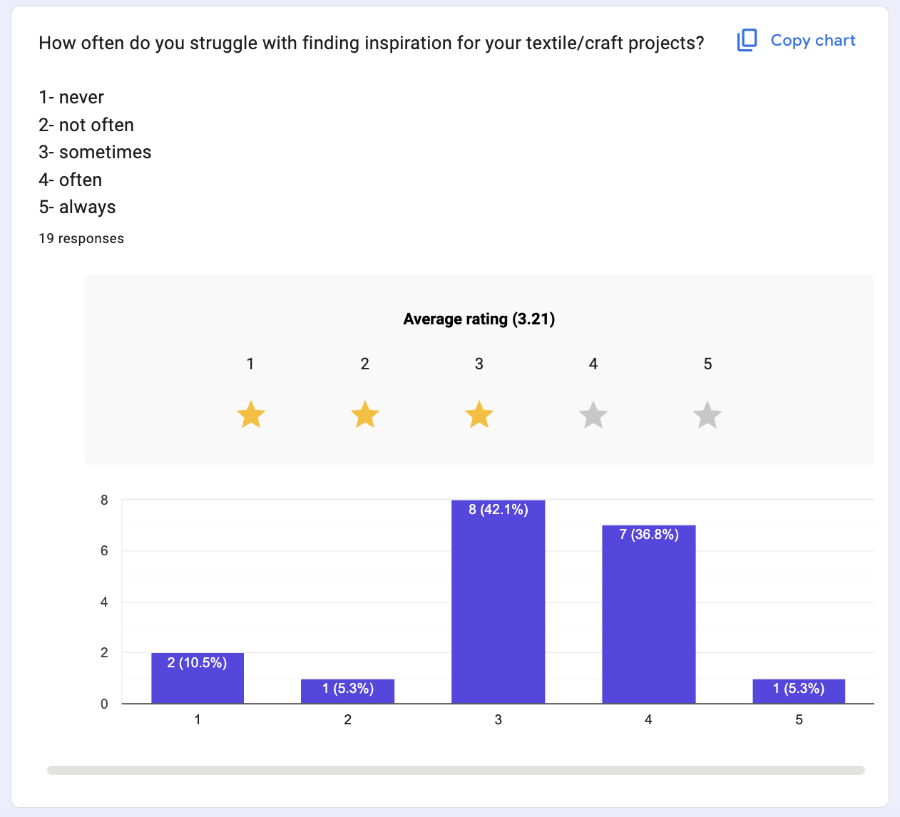
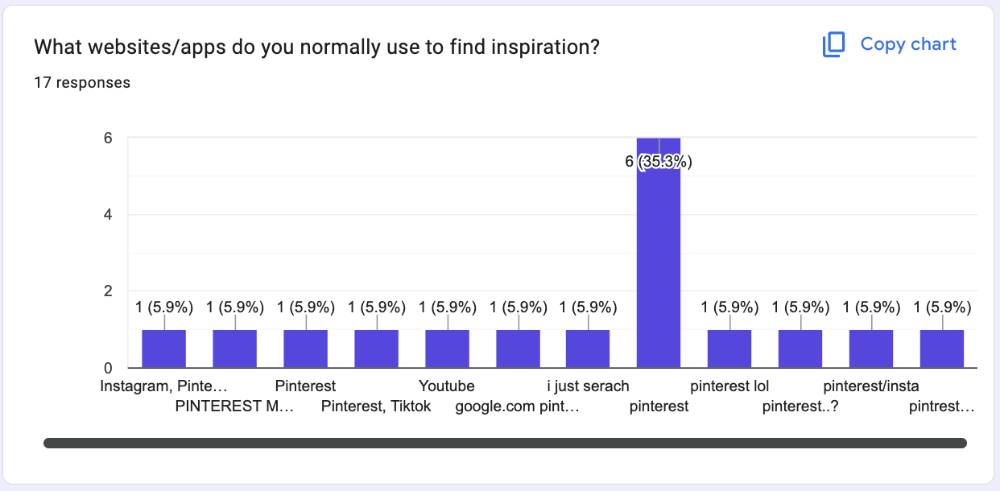
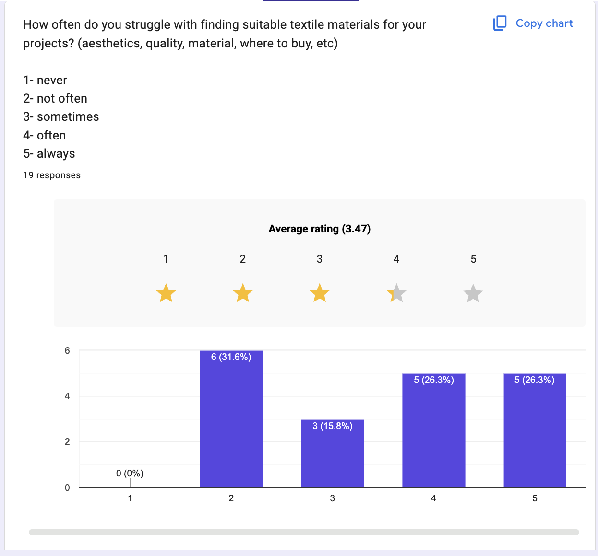
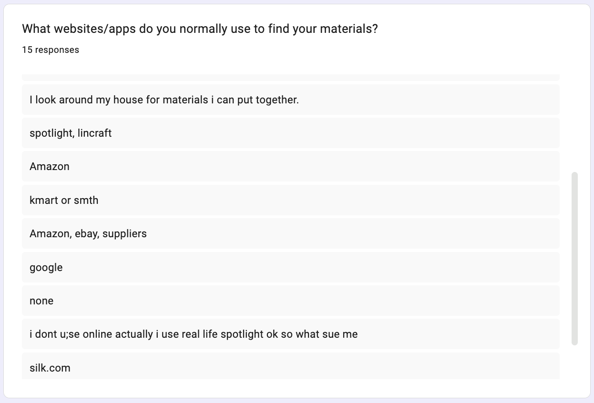
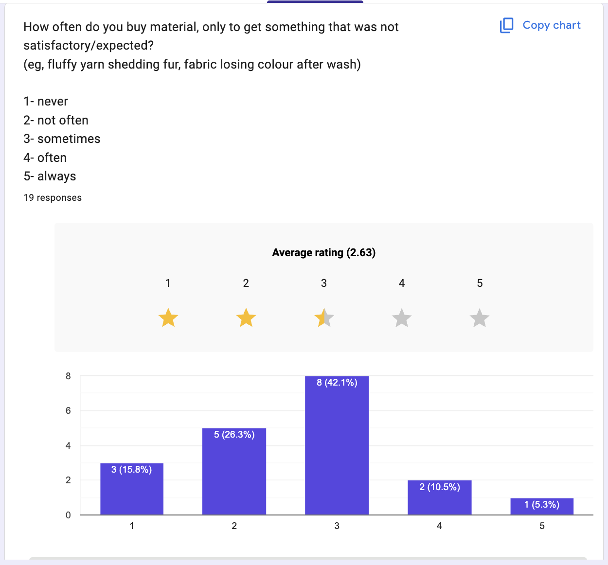
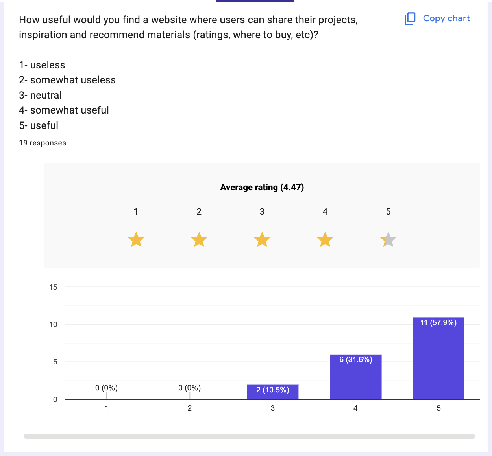

### UI/UX Design
| Design | Column 2 |
| :--- | :--- |
| Design 1 (filter)| 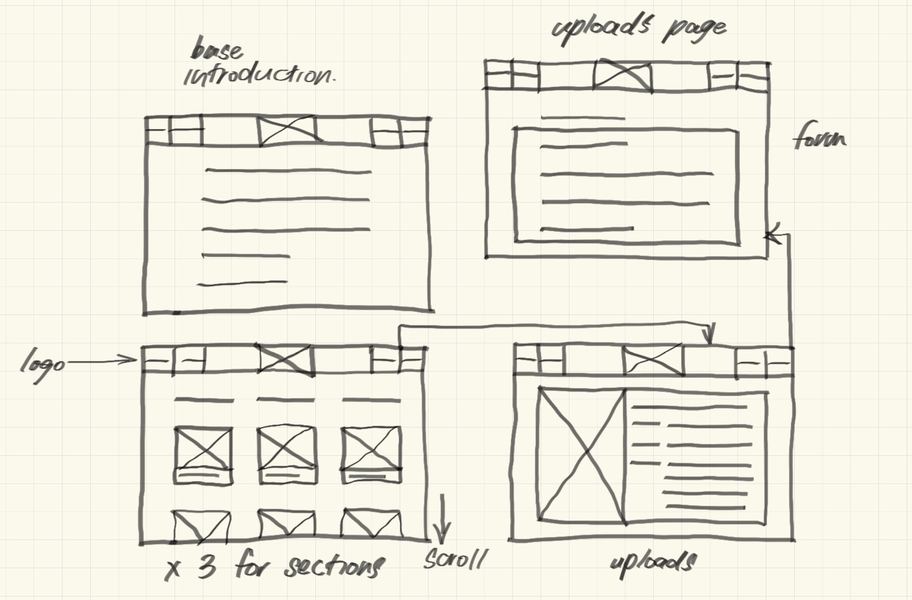 |
| Design 2 (gallery)| 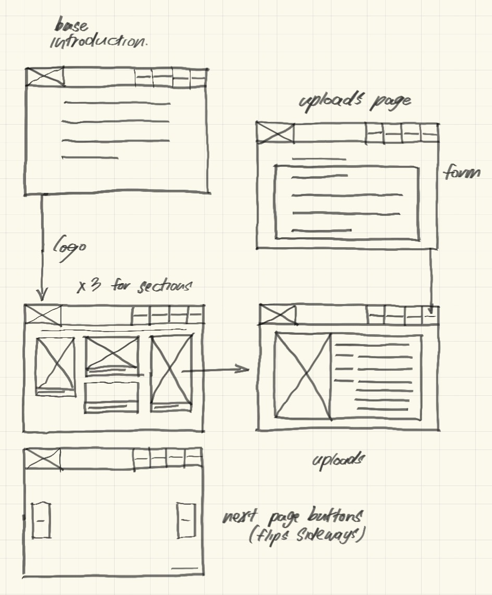 |
| Design 3 (side navbar, scroll down)| 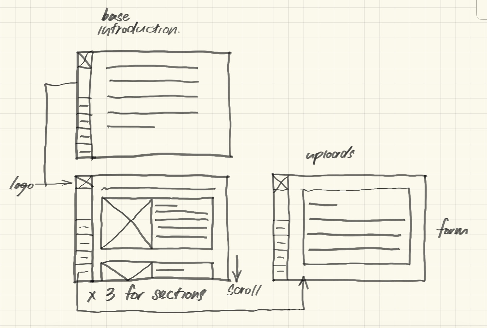 |
### Prototype

## Producing and implementing
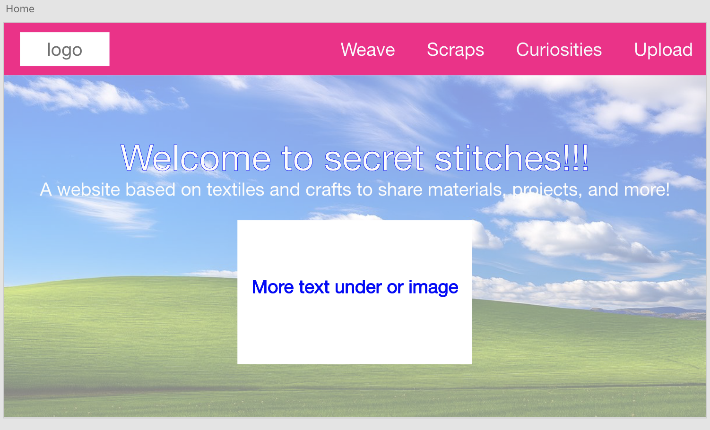
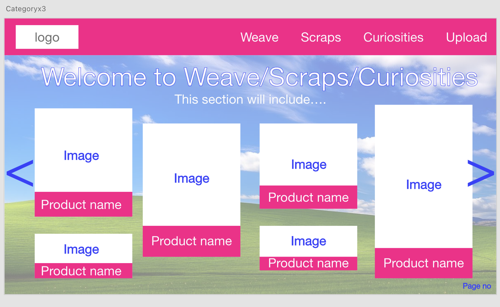
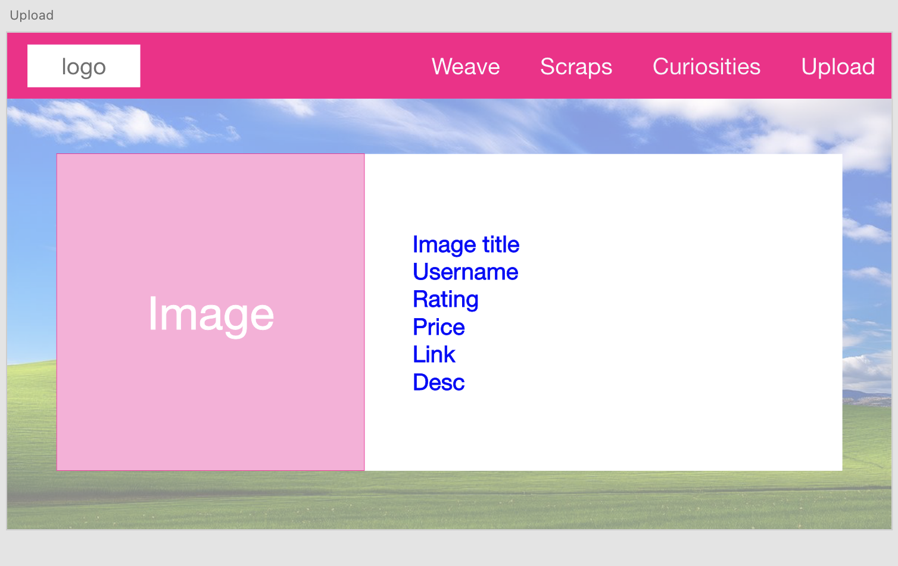
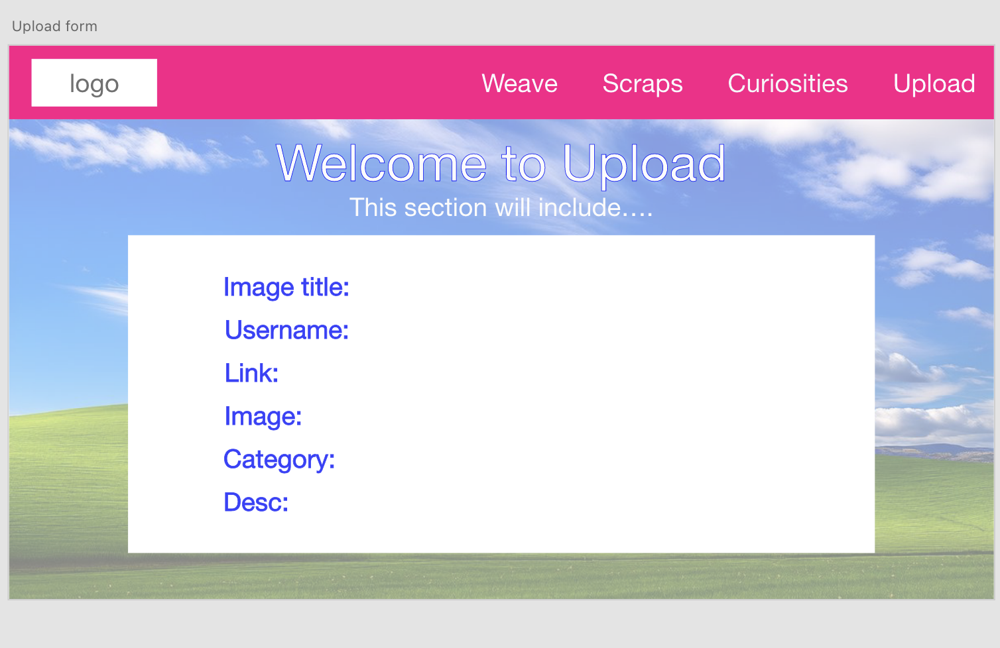
### Development process

## Testing and Evaluating

### Peer evaluation

**Arisa's Website**:

"It’s definitely influential because there are SO many artists and new artists who have no idea what apps or resources to use, I feel like good websites for art are super hard to find, aside from pinterest nobody can really name any off of their mind. Finding resources and apps is pretty hard to research one by one, people usually just go with the more popular ones, but it’s good to really know what is suitable for you, and this website makes it easy to have a brief yet informative overview of the sites you can use. I really like the finder specifically because it helps you sift through everything more efficiently, and you don’t have to read through all of them to find ones that cater to your preferences and interests. The graphics and animations of the cats really tie the website together, it’s nice to look at art in an art website, and I like how it’s on the topmost layer, it has a really cool effect. Other animations (also the flipbook) including underlines for the buttons in the navigation bar makes the website more elevated/engaging and allows users to quickly find interactive elements.
I wish the website would be more colorful, there’s not much that grabs my attention, it's especially important as it is an art website, and it should be appealing to the art community. Something specific: I wish the nav bar would be a different colour, it kind of just blends in with the page. Another thing, some buttons aren’t inline, I’m very specific about spacing, and it makes me mad."

**Yuna's Website**:

"I think its pretty influential as pokemon is kind of a hard hobby to get into and learn, there's so many sets and knowledge and cards, and not much places you can learn about the pokemon sets and stuff so easily, its very good for beginners who want to just get a grasp on the hobby and be able to learn some basics about it, it does serve its purpose well. I would say Pokemon is global. It's very interactive in the sense that it’s not just words on a page, I like the animations of the words and buttons, the animations are consistent too so I know exactly what i’m looking at. There is a clear call to action with the arrows next to the buttons, it makes the audience want to learn more about the subjects (eras). It has lots of graphics and is spaced nicely, it feels simple yet informative at the same time without too much text overload and overstimulation. The font is also easy to read. Scroll to explore is chef's kiss wonderful (love how it fades), though I do wish it would be a little bigger, but I’m really picky with sizing so it might just be me. Also the little psyduck in the corner for home, I wish it was bigger too, I wouldn’t have known what it was for without explanation."

**My website:**

### Evaluation of issues

### Project evaluation

